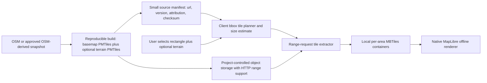

# Long-Term Offline Map Implementation (client extraction + PMTiles)

Status: design proposal; on-device vector→raster conversion slice implemented, native MapLibre/terrain not implemented  
Decision date: 2026-07-14  
Applies to: MAP-004 through MAP-009, OFF-001 through OFF-012, and STO-001
through STO-007

This guide defines a long-term path from the current per-tile raster downloader
to legal, download-on-demand offline maps. An initial fully-on-device slice is
implemented differently from the original PMTiles plan: free **vector** MBTiles
tiles are read on the device and rasterized to PNG with `vector_tile_renderer`
behind `TRAIL_VECTOR_MBTILES`, then stored and rendered through the existing
raster layer. This avoids the `pmtiles` package, whose protobuf 6 requirement
conflicts with the vector renderer's protobuf 3. Native MapLibre **vector**
rendering, terrain, and a production hosted source remain unbuilt. See
[Implemented Details and Current Status](02-implementation-status.md) for exactly
what exists today.

## 1. Feasibility decision

Yes, an offline mobile map based on OpenStreetMap data can be legal and can
avoid per-user map licensing fees.

It cannot be assumed to have zero operating cost:

| Component | Can be free/open? | Production reality |
| --- | --- | --- |
| OpenStreetMap source data | Yes, under ODbL 1.0 | Attribution and ODbL obligations remain. |
| PMTiles v3 archive format | Yes, open format | A format is not a hosted map provider. |
| Tile-generation software | Yes, open-source tools are available | Builds require compute, storage, and maintenance. |
| Flutter rendering libraries | Open-source candidates exist | Compatibility and device performance must be verified. |
| Package hosting and downloads | Sometimes within a free tier | Storage, CDN egress, and abuse protection normally cost money at scale. |
| App use while offline | Yes | The complete package, style, fonts, and sprites must already be local. |

The realistic target is therefore **no recurring commercial map-license fee**,
not a promise of permanently zero infrastructure cost.

## 2. Terms that must not be conflated

- **OpenStreetMap data** is an open geographic database licensed under ODbL.
- **OpenStreetMap standard raster tiles** are images served by the
  community-funded `tile.openstreetmap.org` service. That service prohibits
  offline download and bulk prefetch.
- **PMTiles** is a single-file archive format for raster or vector Z/X/Y tiles.
  It does not grant rights to the archive's data, style, fonts, sprites, or
  imagery and does not provide hosting.
- **Mapbox Vector Tile (MVT)** is the encoded vector-tile payload that a PMTiles
  archive can contain.
- **A basemap schema and style** decide which features appear and how they are
  drawn. Their licenses must be checked separately from OSM and PMTiles.
- **Terrain (hillshade and contours)** comes from a separate elevation dataset,
  not the basemap, and carries its own license and storage cost.

Never enable offline download merely because a URL ends in `.pmtiles`. Record
and verify the complete data, style, asset, and distribution license chain.

## 3. Recommended target

Use the following production architecture unless the device spike in section 12
disproves it:

1. Use **PMTiles v3 containing MVT vector tiles** as the hosted source format.
2. Start from an auditable OSM-derived basemap build, such as the Protomaps
   Basemap daily build, or build the same schema from OSM extracts with an
   open-source pipeline.
3. Host one or a few source PMTiles archives (regional or planet) in
   infrastructure controlled by this project.
4. **Download exactly the user's selected rectangle** by reading only the tiles
   inside those bounds from the hosted archive over HTTP range requests, then
   store them in a local per-area container. Bandwidth and storage scale with
   the selected area, not with a whole region.
5. Optionally let the user also include **terrain (contours + hillshade)** for
   the same rectangle from a separate hosted terrain archive.
6. Render locally with a **native MapLibre** engine using an offline style whose
   glyphs and sprites ship in the app. Offline mode must make no network request.
7. Verify, resume, and reconcile every download; deleting an area must not break
   another overlapping area.
8. Keep pure-Dart `flutter_map` vector rendering and pre-built regional packages
   as documented fallbacks, not the default.

PMTiles is read-only. The hosted source archive is immutable and versioned; a
source update publishes a new version rather than mutating a file in place.

### 3.1 Why client-side extraction is the default

The current MVP already lets a user draw a rectangle. Keeping that interaction
and downloading exactly that rectangle is the best fit for trail runners, who
prepare a small area around one trailhead rather than a whole state.

- Storage and transfer scale with the selected area.
- No per-region pre-build, signing, or catalog pipeline is required for v1.
- A single hosted source archive can serve unlimited user-chosen areas.
- The same flow extends to an optional terrain layer for the same bounds.

Pre-built regional packages (section 4.2) remain useful later for popular
regions, but they are an optimization, not the primary mechanism.

### 3.2 Feasible distribution models

Choose the operating model explicitly:

- **Project-hosted source archive (recommended):** host one or a few immutable
  PMTiles archives; clients extract exactly the selected area. Open data avoids a
  map-license fee, but the project pays or obtains sponsorship for storage and
  range-request transfer.
- **User-imported PMTiles/MBTiles:** can eliminate the project's map-download
  hosting cost. The user obtains a compatible archive and imports it through a
  file picker. The app must validate format, schema, style compatibility,
  integrity, bounds, and license notices. Useful as an advanced fallback.
- **Bundled starter area:** a small pre-extracted area shipped in the app for a
  first-run demo. It increases app size and does not scale to many regions.
- **Third-party hosted endpoint:** acceptable only when that service's terms
  explicitly allow production mobile range access and offline retention. The
  Protomaps daily-build documentation discourages hotlinking, so its build URL
  must not be the released app's runtime backend; copy it into project storage.

Free tiers and sponsorship can reduce early costs but are not an availability or
pricing guarantee. The release plan must include ownership and a budget.

## 4. Primary download: client-side area extraction

The client turns the user's selected rectangle into offline tiles by reading
only the needed tiles from a hosted source PMTiles.

1. Resolve the hosted source archive for the chosen map style and its version.
2. Enumerate the unique Z/X/Y tiles covering the selected bounds across the
   selected zoom range, honoring the source's min/max zoom.
3. Open the remote archive over HTTP and batch-read only those tiles using
   range requests. The `pmtiles` Dart package reads tiles by tile ID and can
   fetch many tiles in one optimized pass to reduce round trips.
4. Write the received MVT tiles into a local per-area container (an MBTiles
   SQLite file via the `mbtiles` Dart package, or an equivalent local tile
   store). Deduplicate tiles shared with an already-installed area.
5. Persist progress after each batch so an interrupted extraction resumes.
6. On completion, record the exact byte total from the written tiles and mark
   the area complete only after the container is readable and consistent.

Because the source archive is immutable and versioned, an extracted area records
the source id and version so it can be validated, updated, or reconciled later.

This model needs no signed package catalog and no per-region build for v1: one
hosted source archive serves any user-selected area.

### 4.1 Optional terrain (contours + hillshade)

The Protomaps basemap has no contour or hillshade layer. Trail runners rely on
terrain, so offer it as an explicit per-download option rather than forcing it on
every area or omitting it.

- Present an **"Include terrain (contours + hillshade)"** toggle in the download
  editor, defaulted from user preference.
- When enabled, extract Terrarium-encoded RGB elevation tiles for the same
  bounds and a suitable zoom range from a separate hosted terrain PMTiles (for
  example a Mapterhorn-derived archive), into a parallel local container.
- MapLibre renders a hillshade layer from the local terrain tiles and can derive
  contour lines from the same elevation data.
- Show the added storage before download; terrain increases an area's size and
  must be reflected in the estimate and in actual usage.
- Record the terrain source, version, attribution, and license separately from
  the basemap; terrain datasets have their own terms.
- Deleting an area removes its terrain tiles under the same overlap-safe rules.

### 4.2 Optional pre-built regional packages (scale stage)

For popular regions, a later optimization can host pre-extracted regional
packages so common areas download in one request instead of many range reads:

- Administrative or park packages where boundaries are meaningful to users.
- Fixed Web Mercator grid packages where no named boundary fits.
- A shared low-zoom overview package.

If added, resolve the selection to the smallest covering set and state any extra
coverage honestly, for example: "This region package is 284 MB and covers about
18% beyond your selection." This path reuses the download, verification, and
overlap-safe deletion machinery and is governed by the optional catalog in
section 6. It is not required for the first production release.

## 5. End-to-end architecture



The application must depend on project-owned abstractions, not directly on a
specific plugin:

```text
MapSourceManifest
  resolveSource(styleId) -> hosted archive url, version, zooms, attribution

OfflineAreaPlanner
  plan(selection, zoom range, installed areas) -> tile plan + size estimate

AreaTileExtractor
  extract(plan) from remote PMTiles via range reads -> local container

OfflineAreaStore
  write/verify/open/delete/reconcile local area containers

OfflineTileSource
  resolve z/x/y (basemap + optional terrain) against installed areas

MapRendererAdapter
  online, auto, and strictly offline rendering
```

Only adapters may import the chosen PMTiles, MBTiles, or renderer packages.

## 6. Source manifest and optional package catalog

For the primary extraction model, the client only needs a small, trusted
**source manifest** describing the hosted archives. Host it separately from the
archives so it can change without republishing an archive:

```json
{
  "schemaVersion": 1,
  "manifestVersion": "2026-07-14T00:00:00Z",
  "sources": [
    {
      "styleId": "trail-basemap-v1",
      "kind": "basemap",
      "format": "pmtiles",
      "pmtilesSpecVersion": 3,
      "tileType": "mvt",
      "minZoom": 0,
      "maxZoom": 15,
      "url": "https://maps.example.org/sources/trail-basemap-2026-07-14.pmtiles",
      "version": "2026-07-14",
      "sha256": "<64 lowercase hexadecimal characters>",
      "attributionIds": ["osm-odbl", "protomaps-produced-work"]
    },
    {
      "styleId": "trail-terrain-v1",
      "kind": "terrain",
      "format": "pmtiles",
      "tileType": "terrarium",
      "minZoom": 0,
      "maxZoom": 12,
      "url": "https://maps.example.org/sources/trail-terrain-2026-07-14.pmtiles",
      "version": "2026-07-14",
      "sha256": "<64 lowercase hexadecimal characters>",
      "attributionIds": ["mapterhorn-terrain", "osm-odbl"]
    }
  ],
  "attributions": {
    "osm-odbl": { "display": "OpenStreetMap", "url": "https://www.openstreetmap.org/copyright" },
    "protomaps-produced-work": { "display": "Protomaps Basemap", "url": "https://docs.protomaps.com/basemaps/downloads" },
    "mapterhorn-terrain": { "display": "Mapterhorn", "url": "https://mapterhorn.com/" }
  }
}
```

Manifest rules:

- Serve the manifest and archives over HTTPS with immutable, versioned archive
  URLs and an allowlisted host.
- Reject unknown schema, PMTiles, or tile-type values.
- Validate zoom limits, URL host, checksum syntax, and required attributions
  before extraction.
- Pin the manifest signing key or a manifest hash through a trusted release or
  configuration channel; do not blindly trust a fetched manifest.
- Keep API secrets out of the manifest and the mobile binary.

If optional pre-built regional packages (section 4.2) are added later, host a
fuller **package catalog** with per-package bounds, sizes, hashes, and immutable
download URLs. That catalog reuses the same trust, validation, and attribution
rules and is only needed at that scale.

## 7. Source build and hosting

The primary model needs a hosted source archive, not a per-region package set.
The build produces and publishes the basemap (and optional terrain) source
PMTiles that clients extract from.

### 7.1 Choose one auditable input

Preferred starting points:

- A Protomaps Basemap PMTiles daily build, distributed as an ODbL Produced Work
  requiring OpenStreetMap attribution. Copy it into project storage; its
  documentation discourages hotlinking the build URL.
- Geofabrik `.osm.pbf` extracts, followed by a reproducible vector-tile build.
- The OSM planet file for organizations prepared to operate a global build.
- For terrain, a Terrarium-encoded elevation source such as a Mapterhorn build,
  reviewed under its own license.

Do not combine Google, Apple, or another proprietary map's geometry, imagery,
labels, or styling assets without explicit compatible rights.

### 7.2 Record provenance before hosting

For every source archive, persist:

- Upstream URL and retrieval timestamp in UTC.
- Upstream version or snapshot date and checksum, plus the locally recomputed
  checksum.
- Applicable data, produced-work, and terrain license notices.
- Tool names, versions, container digests, and exact commands.
- Basemap schema, style, glyph, and sprite versions.
- Output archive ids, kind, tile type, bounds, zooms, size, and checksum.

This provenance record is a release artifact. Do not rely on memory or a mutable
web page to reconstruct it later.

### 7.3 Produce and validate source archives

Use pinned build containers. Either copy a validated upstream PMTiles or build
one:

```text
Geofabrik/OSM PBF
  -> pinned Planetiler or equivalent basemap profile
  -> PMTiles v3 (MVT)
  -> validate -> hosted immutable basemap source
```

Fail the build if an archive has an unexpected PMTiles version or tile type, is
missing style-required source layers, lacks required attribution, or has a
checksum different from the manifest. If optional regional packages (section 4.2)
are produced, extract them from the same source with `pmtiles extract` and apply
the same validation.

### 7.4 Publish safely

Host archives under immutable, versioned paths and update the manifest only after
each archive is uploaded and verified. Configure:

- HTTP byte-range support (required for client extraction).
- Correct `Content-Length`, `ETag`, and `Last-Modified` behavior.
- Long-lived cache headers on immutable archives; shorter on the manifest.
- CORS only if a future web client needs it.
- Rate limits and range-abuse monitoring without logging precise user GPS.
- Rollback by publishing a new version and repointing the manifest, never by
  mutating an existing archive.

## 8. Mobile extraction workflow

### 8.1 Planning

1. Load a cached, validated source manifest and refresh it when online.
2. Resolve the basemap source (and terrain source if the toggle is on).
3. Enumerate the unique tiles covering the selected bounds and zoom range,
   clamped to each source's min/max zoom.
4. Exclude tiles already present for a compatible installed area and source
   version.
5. Estimate transfer and storage from the source's typical tile sizes, and label
   it an estimate until real bytes are known.
6. Query available device storage and reserve headroom for the basemap
   container, the terrain container, and database writes.
7. Show estimated size, tile count, selected area, snapshot version, maximum
   zoom, terrain on/off, and attribution before confirmation.

Do not reuse the old fixed 32 KiB-per-raster-tile estimate for vector tiles.

### 8.2 Extraction and resume

For each area:

1. Persist the tile plan and source version before network work starts.
2. Open the remote source archive and read tiles in bounded batches using range
   requests.
3. Write received tiles into `<area>.mbtiles.part` (basemap) and, if enabled,
   `<area>.terrain.mbtiles.part`.
4. Commit progress after each batch so an interruption resumes from the last
   persisted tile rather than restarting.
5. Retry timeouts, connection failures, HTTP 429, and HTTP 5xx with capped
   exponential backoff and jitter; do not retry permanent 4xx forever.
6. Bound concurrency; start conservative and measure before increasing it.
7. If the source version changed mid-extraction, discard and restart against the
   new version rather than mixing versions.
8. On completion, verify the tile count against the plan, confirm each container
   opens and reports the expected coverage, then atomically rename the `.part`
   containers into place.
9. Commit area state, source version, and tile references transactionally.

Pause stops scheduling new reads and closes the active response after persisting
progress. Cancel leaves a resumable partial container unless the user chooses
"Discard download." Deleting an area removes only tiles no other area references.

### 8.3 Storage layout

Use deterministic, versioned paths:

```text
offline_areas/
  <source-id>/
    <source-version>/
      <area-id>/
        basemap.mbtiles
        terrain.mbtiles        (only when terrain was included)
```

Never derive a path from an unvalidated manifest string. Sanitize ids, resolve
the final path, and assert that it stays inside the area root. Mark the
reproducible tile containers and partial files as excluded from iOS iCloud and
Android cloud backup. User-created routes and activities keep their separate
backup policy; excluding replaceable maps must not exclude personal data.

## 9. Persistence migration

Do not alter the existing schema-version-1 creation script in place. Add an
explicit migration and migration tests. Names may follow repository conventions,
but the model needs these concepts:

```text
map_sources
  source_id, style_id, kind (basemap|terrain), tile_type, min_zoom, max_zoom,
  version, attribution, license_url

offline_areas (extend the existing table)
  ... existing columns ...,
  basemap_source_id, basemap_source_version,
  terrain_included, terrain_source_id, terrain_source_version,
  status, tile_count, actual_bytes, last_error

area_tiles
  area_id, source_id, source_version, kind, zoom, x, y, byte_count

map_manifest_state
  fetched_at_utc, manifest_version, verified_manifest_json
```

Local tiles may live in per-area MBTiles containers with `area_tiles` as the
index, or directly in a shared tiles table; either way keep a deterministic key
of source id, source version, kind, zoom, x, and y.

Required constraints:

- Unique tile identity includes source, version, kind, zoom, x, and y.
- Area/tile references use foreign keys.
- An area cannot become `complete` before its containers verify.
- Byte and tile counters are non-negative and cannot exceed the plan.
- Deletion checks reference counts transactionally so overlapping areas keep
  shared tiles.
- Existing raster areas remain readable during migration and rollout.

Use separate statuses for `planned`, `downloading`, `paused`, `verifying`,
`complete`, `failed`, `updating`, and `deleting`. Persist a typed failure code
plus user-safe detail; do not parse exception strings to decide whether Resume is
possible.

## 10. Rendering architecture

### 10.1 Primary: native MapLibre

Trail running needs hillshade, contours, and reliable performance during long
screen-on sessions, so the primary renderer is a maintained native MapLibre
Flutter integration.

As of 2026-07-14, candidate packages on pub.dev include `maplibre` and
`maplibre_gl` (native MapLibre), with `pmtiles` and `mbtiles` as the Dart archive
and local-container libraries. These are candidates, not approved dependencies.
Before adding them, inspect source, licenses, transitive dependencies, release
activity, local-file and offline-style support, and Android/iOS behavior. Pin
compatible versions only after the spike passes.

MapLibre must be driven by an offline style that:

1. Reads basemap MVT tiles from the local per-area container.
2. Reads terrain tiles from the local terrain container when present, and draws
   hillshade and contour layers from them.
3. Uses only app-bundled glyphs and sprites; it must not fetch remote assets.
4. Resolves each area by bounds and source version, preferring installed
   coverage and showing explicit missing coverage otherwise.
5. Makes no network request in Offline mode.
6. Exposes basemap and terrain attribution to the map UI.

Keep route polylines, current position, recording track, selection rectangle,
and camera controls as overlays above the MapLibre basemap.

### 10.2 Mandatory offline style assets

The style JSON, fonts, glyphs, sprites, and icons must ship in the app or install
as versioned offline assets. A local archive is not truly offline if its style
requests remote glyphs or sprites. Validate that every style source maps to a
local adapter, every referenced source-layer exists, fonts cover target scripts,
asset licenses permit redistribution, missing optional layers fail visibly
without crashing, and attribution stays legible.

### 10.3 Fallbacks

If native MapLibre is unworkable for a target:

1. Pure-Dart `vector_map_tiles` on `flutter_map` (version 8.3.1 in this project)
   with a local MBTiles/PMTiles vector source. It cannot render hillshade from
   terrain-RGB, so terrain would be limited or unavailable on this path.
2. Raster fallback only for narrowly bounded regions; far larger at deep zoom.

Do not run two production renderers indefinitely. Use a feature flag during
migration, collect evidence, then retire the failed path.

## 11. User experience

The existing two-corner selection stays. Its result becomes an exact extraction
plan for the selected rectangle.

Before download, show:

- The selected rectangle (the area actually downloaded).
- The **Include terrain (contours + hillshade)** toggle and its added size.
- Estimated size and required free-space headroom.
- Source snapshot version and maximum offline zoom.
- Whether Wi-Fi-only download is enabled.
- Required basemap and terrain attribution.

During download, show received bytes, tile progress, status, pause, resume,
cancel, and retry. During verification, show a distinct "Verifying map" state;
fully received is not yet complete.

After installation:

- Preview must force Offline mode.
- Coverage gaps must be visually explicit.
- Area deletion must state shared tiles that will be retained.
- Source updates must show their size and never remove the working area until the
  replacement verifies.
- An About/Data Licenses screen must remain available with no network.

## 12. Required technical spike

Before schema migration or hosting work, build a disposable spike behind a
compile-time flag. On physical Android and iOS devices it must answer:

1. Can native MapLibre render an offline style from a local MBTiles/PMTiles area
   with app-bundled glyphs and sprites and no network?
2. Can the `pmtiles` Dart reader range-read a bounded set of tiles from a remote
   source archive and write them into a local MBTiles container?
3. Can hillshade and contours render from a local terrain container?
4. Do route, track, location, and selection overlays behave correctly above it?
5. Is panning responsive at zooms 8, 12, and 15 on a mid-range device, including
   overzoom beyond the source maximum?
6. What are cold-open time, steady and peak memory, frame misses, and battery use
   for 100 MB, 500 MB, and 1 GB installed areas, with and without terrain?
7. Does airplane mode produce zero network attempts?
8. Does corrupted or truncated input fail safely?
9. Do labels, text shaping, and fonts work for the target languages?
10. Can containers be replaced and deleted without leaking open handles?

Set pass targets before running. At minimum: no out-of-memory failure, no blank
map after a warm load, no network request in Offline mode, and no sustained
interaction jank on the baseline device.

## 13. Security and privacy

- Use HTTPS and an explicit source-host allowlist.
- Verify manifest trust and source SHA-256; verify each local container opens and
  matches its plan before marking an area complete.
- Apply strict manifest, area-count, byte-size, string-length, and zoom limits.
- Treat PMTiles metadata, tile bytes, and vector attributes as untrusted input.
- Do not interpolate source labels into SQL, paths, logs, or UI without
  validation and escaping.
- Do not log selected bounds, source URLs containing credentials, or complete
  location history.
- Range requests reveal to the host which tiles, hence roughly which area, a user
  extracts. Prefer a broad-coverage source and, where privacy is critical,
  consider larger fetch granularity so exact intent is less observable.
- Keep credentials out of the repository and client where possible; public
  immutable sources normally need no secret in the app.

## 14. Legal and attribution release gate

This section is engineering guidance, not legal advice. Before each production
source or style release, record an explicit review of:

1. OSM/ODbL attribution and share-alike obligations.
2. Whether the distributed archive is source data, a Derivative Database, a
   Produced Work, or a collective database.
3. Protomaps or other basemap schema/build terms.
4. Non-OSM boundary, place, landcover, terrain, and elevation datasets.
5. Style code, sprites, icons, fonts, and glyph redistribution rights.
6. Object-storage and CDN terms.
7. Any required offer or method for recipients to obtain a Derivative Database.
8. The exact attribution shown on-map and in the offline Data Licenses screen.

At minimum, an OSM-derived interactive map should visibly credit
OpenStreetMap and provide access to `https://www.openstreetmap.org/copyright`,
and credit any separate terrain or elevation source under its own terms.
Preserve required notices in source metadata and in an offline application
screen. Do not imply that OpenStreetMap, Protomaps, or a terrain provider
endorses the application.

## 15. Test plan

### 15.1 Pure Dart tests

- Manifest parsing, trust/hash checks, validation, and unknown-value rejection.
- Bounds-to-tile enumeration at zoom boundaries and the antimeridian.
- Installed-area/version reuse and deduplication.
- Tile-plan minimization and size estimation.
- Path sanitization and traversal rejection.
- Range-read request construction and response validation.
- Retry classification, cancellation, process recovery, and state transitions.
- SHA-256 mismatch, truncated data, invalid PMTiles header, and wrong tile type.
- Overlap-safe reference counting and source-version update replacement.

### 15.2 Repository and migration tests

- Upgrade a populated version-1 database without losing raster areas, routes,
  activities, or settings.
- Reopen every download state after process termination.
- Transaction rollback on write, update, and deletion failures.
- Reconcile missing, partial, corrupt, unreferenced, and superseded tiles and
  containers.
- Confirm actual storage numbers match files on disk.

### 15.3 HTTP integration tests

Use a controllable local server serving a small PMTiles for:

- Range reads returning `206`, a `200` fallback, invalid `Content-Range`, `416`.
- ETag/version match and mismatch.
- Disconnect and resume at multiple tile offsets.
- HTTP 404, 429 with `Retry-After`, and transient 5xx.
- Slow response, timeout, cancellation, and bounded concurrency.
- Source version change mid-extraction.

### 15.4 Widget and device tests

- Selection overlay and terrain toggle with size impact.
- Free-space rejection, Wi-Fi policy, and confirmation.
- Download, pause, resume, cancel/discard, verify, update, and deletion UI.
- Accessibility and text scaling for long area and error labels.
- Airplane-mode cold start and navigation at every supported zoom, with terrain.
- Android process death and iOS termination/relaunch during extraction.
- Low storage, permission/storage failures, and open-container replacement.
- Physical-device frame, memory, battery, and thermal measurements.

## 16. Implementation sequence

### Phase 0: approve decisions

- Confirm PMTiles v3 MVT source, native MapLibre renderer, client extraction,
  and optional terrain.
- Select the source snapshot, style, glyphs, sprites, zoom range, and terrain
  source.
- Complete the legal checklist and set area, zoom, and total-storage limits.

Exit: decisions and license evidence recorded in this wiki; no code merged on
assumptions.

### Phase 1: walking skeleton spike

- Host one small source PMTiles (basemap) and, if in scope, one terrain PMTiles.
- Render an offline MapLibre style from a local fixture container with bundled
  glyphs and sprites.
- Range-extract a hard-coded bbox from the hosted source into a local MBTiles and
  render it with route/location overlays.
- Run the section 12 spike on physical Android and iOS devices.

Exit: a hand-picked area extracts, renders offline with zero network, and meets
the performance and storage thresholds.

### Phase 2: extraction domain

- Add manifest, source, tile-plan, and typed-failure models.
- Implement bbox tile enumeration, installed-area reuse, and size estimation.
- Add deterministic tests, including antimeridian selections.

Exit: a selected rectangle produces a deterministic tile plan and estimate.

### Phase 3: resumable extractor and store

- Add the schema migration and repositories.
- Implement batched range reads, local container writes, progress persistence,
  verification, atomic install, process recovery, and reconciliation.
- Implement free-space checks before and during extraction.

Exit: a test server proves extraction, pause, resume after restart, corruption
rejection, source-version update, and overlap-safe deletion.

### Phase 4: map integration

- Wire Auto, Online, and Offline modes to the MapLibre offline style.
- Add the optional terrain layer (hillshade + contours) from local terrain tiles.
- Make missing coverage explicit and preserve attribution.
- Keep the current raster path behind a migration flag.

Exit: an extracted area renders after a network-disabled cold start with zero
network attempts, terrain included when selected.

### Phase 5: offline-map user journey

- Replace raster tile-count planning with exact extraction size and the terrain
  toggle.
- Add storage headroom, Wi-Fi policy, verification state, updates, and licenses.
- Preserve shared tiles across overlapping saved areas.

Exit: OFF-001 through OFF-012 and STO-001 through STO-007 have automated and
device evidence, or each remaining gap is documented.

### Phase 6: hosting and supply chain

- Build, validate, and publish at least one production-quality source archive
  (and terrain) with range support and a signed or pinned manifest.
- Document rollback, source updates, retention, and incident response.
- Monitor aggregate transfer/error metrics without location telemetry.

Exit: a fresh client discovers, extracts, verifies, and renders an area solely
from production endpoints.

### Phase 7: rollout and retirement

- Migrate or retain existing raster downloads without data loss.
- Roll out extraction rendering behind a release flag.
- Verify supported Android and iOS versions.
- Remove the public OSM development-download override from release builds.
- Retire the legacy raster downloader only after rollback is no longer needed.

### Optional later: pre-built regional packages

Add the section 4.2 regional packages and the fuller section 6 catalog only if
usage shows repeated large-area downloads that justify the extra pipeline.

## 17. Release acceptance

Offline maps are production-ready only when all are true:

- A documented source, style, asset, and license chain (basemap and terrain) is
  approved.
- The released app never bulk-downloads from `tile.openstreetmap.org`.
- Source archives and the manifest are served from approved, range-capable
  endpoints.
- Estimated size and available storage are shown before confirmation, including
  the terrain toggle.
- Extraction pauses, resumes after process restart, retries safely, and rejects
  corruption.
- Completion requires source verification and readable local containers.
- Overlapping areas share tiles without unsafe deletion.
- Offline mode cold-starts in airplane mode with zero network attempts.
- Hillshade and contours render offline when terrain was included.
- All style assets and license notices work offline.
- Physical Android and iOS devices pass the performance and storage matrix.
- Source build, checksums, and hosting are reproducible and owned.
- Ongoing hosting cost and ownership have an explicit operational owner.

## 18. Explicitly prohibited shortcuts

- Do not range-read or scrape `tile.openstreetmap.org`; extract only from
  project-hosted or extraction-permitted sources.
- Do not hotlink Protomaps daily-build URLs from the released app; copy into
  project storage.
- Do not label a source "free" without recording its data and asset licenses.
- Do not download a full planet archive to a phone to extract a small area;
  range-read only the selected tiles.
- Do not mark an area complete before verification and a readable container.
- Do not fetch remote fonts, glyphs, sprites, or styles in Offline mode.
- Do not overwrite an installed source version in place.
- Do not delete tiles another saved area references.
- Do not claim zero operating cost or permanent availability of a free tier.
- Do not record implementation status based only on this document or added
  dependencies.

## 19. Open decisions before implementation

1. Basemap source: Protomaps Produced Work copy versus a project-built OSM
   pipeline.
2. Terrain source and default: which elevation dataset, default on or off, and
   its zoom range and license.
3. Maximum detail zoom and per-area size limit for trail use.
4. Local container: per-area MBTiles versus a shared tiles table.
5. Object storage/CDN owner, budget, regions, retention, and range/SLA terms.
6. Background-extraction expectations on Android and iOS.
7. Source update cadence and how long old versions remain supported.
8. Whether and when to add optional pre-built regional packages (section 4.2).

## 20. Primary references

- [OpenStreetMap copyright and ODbL summary](https://www.openstreetmap.org/copyright)
- [OpenStreetMap attribution guidelines](https://osmfoundation.org/wiki/Licence/Attribution_Guidelines)
- [OpenStreetMap standard tile usage policy](https://operations.osmfoundation.org/policies/tiles/)
- [Geofabrik OSM extracts](https://download.geofabrik.de/)
- [PMTiles concepts and specification links](https://docs.protomaps.com/pmtiles/)
- [Protomaps Basemap downloads and partial extracts](https://docs.protomaps.com/basemaps/downloads)
- [Protomaps Basemap layers (no built-in contours or hillshade)](https://docs.protomaps.com/basemaps/layers)
- [MapLibre Native](https://maplibre.org/)
- [pmtiles Dart package](https://pub.dev/packages/pmtiles)
- [mbtiles Dart package](https://pub.dev/packages/mbtiles)

Re-check these policies and all selected dependency licenses at implementation
and before every production source change. Web documentation and service terms
can change.